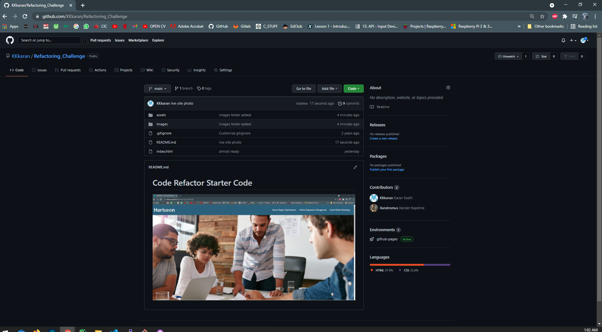

# Code Refactored and site is live!!@

https://kkkaran.github.io/Refactoring_Challenge/

# In this project we refactored the code to html file with the correct semantic elements, added alt att to the image elements, giving a title in the head.

# we also modified the css by deleting the redundant styling and creating a common identifier i.e 'same class name' for the sections with similar style.

# i also added an icon in the title because WHYNOT!!

